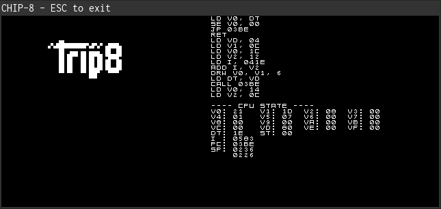

## Chip8 emulator in rust

[](https://travis-ci.org/johannst/chip-remu)

This is a Chip8 emulator I wrote for fun to get started with rust.



### Build and start the emulator

```rust
cargo build --release
./target/release/chip8-remu roms/demos/Zero_Demo_zeroZshadow_2007.ch8
```

The emulator can run in two different operation modes
- `Stepping` to control the CPU execution instruction by instrucion (using `Space` key)
- `FreeRunning` to let the CPU run automatically

### Keymap

Chip8 input keys in the format `chip8_key(physical_key)`:

|        |        |        |        |
|--------|--------|--------|--------|
| 1`(1)` | 2`(2)` | 3`(3)` | C`(4)` |
| 4`(Q)` | 5`(W)` | 6`(E)` | D`(R)` |
| 7`(A)` | 8`(S)` | 9`(D)` | E`(F)` |
| A`(Z)` | 0`(X)` | B`(C)` | F`(V)` |

Control keys:

| Key   | Function                            |
|-------|-------------------------------------|
| G     | Switch to `FreeRunning` mode        |
| B     | Switch to `Stepping` mode           |
| Space | Step instruction in `Stepping` mode |


### License

This project is licensed under [MIT](./LICENSE) license.

Files in `./roms` do not fall under this license. These files come from
[dmatlack/chip8](https://github.com/dmatlack/chip8/tree/master/roms).

### Reference

- https://en.wikipedia.org/wiki/CHIP-8
- http://devernay.free.fr/hacks/chip8/C8TECH10.HTM

